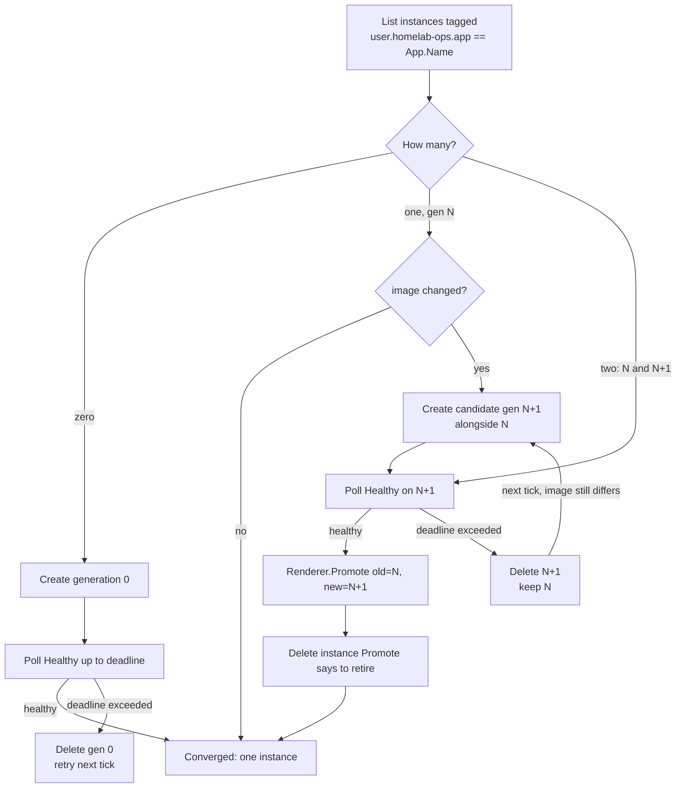
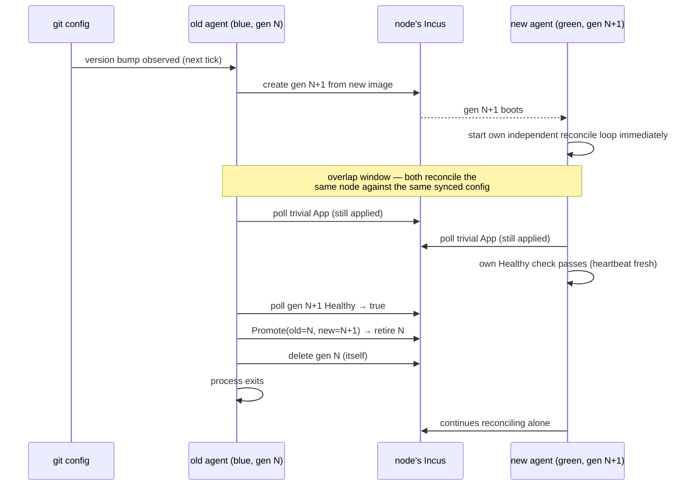

# App Manager — local per-node blue-green reconciliation (0.x)

Purpose
- Define `kind: App`: a workload instance the local app-manager agent (#92) reconciles against one node's live Incus, via a small renderer registry.
- Give every App type a blue-green upgrade path — create a candidate alongside the current instance, health-check it, then promote or revert — without hardcoding one cutover algorithm for every App type.
- Prove the mechanism by having the agent manage its own upgrade (a reserved `type: agent` App), with no operator intervention and no reconciliation gap.

This doc complements `docs/Architecture.md` (system-wide shape) and `docs/Ipam.md` (the sibling per-subsystem policy doc this one mirrors); implementation-level detail lives in `internal/config` (schema), `internal/apprenderer` (registry + reconcile algorithm), and `internal/apprenderer/agentrenderer` (the built-in `agent` renderer).

## `kind: App` schema

```yaml
kind: App
name: agent
node: node0          # references a kind: Instance by name; no cross-node scheduling in 0.x
type: agent          # renderer-registry key
image:
  server: https://ghcr.io
  protocol: oci
  alias: ehharvey/homelab-ops/agent:latest
params: {}           # opaque, renderer-specific passthrough (e.g. extra env vars)
```

- `node` must reference a known `Instance.Name` — a hard validation error otherwise, same "typo is loud" convention as `Instance.Network`.
- `image` must set `alias` or `fingerprint`. `protocol: oci` pointing at `https://ghcr.io` is the production shape (Incus's OCI remote support — confirmed via the vendored `lxc/incus/v7` module's `ConnectOCI`); dev/validation points `server` at a local `registry:2` container instead.
- No per-App `strategy` field: cutover style (single-writer vs. dual-write, see below) is fixed per renderer `type`, not configurable per App instance — a DB renderer and a k8s-node renderer are different renderers, not the same renderer with a flag.
- No `version` field: a version bump is detected generically as "declared `image` differs from what's recorded on the live instance" (see Reconcile algorithm).

## Renderer registry

```go
type Renderer interface {
    Desired(app config.App, name string) (lxcapi.InstancesPost, error)
    Healthy(ctx context.Context, c *incuslocal.Client, name string) (bool, error)
    Promote(ctx context.Context, c *incuslocal.Client, app config.App, old, new string) (retire string, err error)
}
```

This is the seam for renderer-specific cutover behavior instead of one hardcoded blue-green algorithm:
- A **single-writer** renderer (e.g. a future database App, blue = read/write, green = read-only) does real promotion work in `Promote` — a failover/handshake before the old instance is safe to delete.
- A **dual-write** renderer (e.g. Incus-hosted k8s worker nodes, both blue and green can serve/write at once) can make `Promote` a no-op or a short drain.
- The built-in `agent` renderer (proving self-management) has no data-plane cutover at all — its `Promote` is a no-op returning the old instance as safe to retire, because the App *is* the blue-green control plane being exercised, not a workload sitting on top of it.

Registration is explicit (`apprenderer.Register("agent", agentrenderer.Renderer{})`, called from `cmd/agent`'s own setup), not a self-registering blank import — v1 ships exactly one renderer.

## Reconcile algorithm

No local store for the agent: the durable record is Incus itself, via `user.*` config keys and instance naming (`<app.name>-g<generation>`, e.g. `agent-g0`/`agent-g1` — directly legible in `incus list`). This mirrors "the runtime is the source of truth" (Nomad's allocation table, Kubernetes' live Pod list) rather than a separate cache the agent has to keep in sync.

Per App, per reconcile tick:



The "two matches" branch is what makes this restart-safe with zero external state: whether it's a genuine in-flight handoff or an agent that restarted mid-handoff, "what step was I on" is always re-derivable from `incus list` alone — the tick just resumes the healthy/promote-or-revert logic directly.

**Self-recognition rule** (only applies to the App describing the reconciling agent's own instance): before acting, the agent compares its own live instance name against N/N+1.
- It is the older, superseded instance (N): stand down — no create/health/promote action on this one App — unless N+1 has exceeded its health deadline without promoting, in which case revert as normal. Never delete itself.
- It is the candidate (N+1): proceed normally — poll its own `Healthy`, `Promote`, delete N. Never delete itself.
- Neither (the overwhelming common case, including every non-agent App): full normal reconciliation, no special-casing.

One rule lets a single, unmodified reconcile function handle self-management as a special case of the general algorithm, and guarantees neither agent process ever issues a delete against its own running container.

## Self-upgrade handoff: overlap, not a gap

The whole point of #92's done-when criterion is that upgrading the agent itself produces no reconciliation gap — proven by a concurrently-declared trivial App staying reconciled throughout. The mechanism is deliberate overlap, not a coordinated handoff signal:



Green's own `main()` never waits for a handoff signal from blue — it starts reconciling the instant it boots. For the bounded window until blue confirms green healthy and deletes itself, both processes are reconciling the same node concurrently. Concurrency safety during that window is mostly by construction: both compute the same answer from the same inputs each tick (idempotent, level-triggered), and Incus itself serializes/rejects duplicate-name creates and no-ops-with-error on deleting an already-gone instance — the only two operations two overlapping reconcilers could race on. No distributed lock is introduced: at-most-two-actors/one-host scope makes one unnecessary, and this project's minutes-scale RTO tolerance makes a redundant duplicate attempt free.

## Prior art

This design's shape — create a candidate alongside the current instance, health-check it against a deadline, then promote (retire old) or revert (retire candidate) — is a scaled-down version of patterns already proven in cluster schedulers, adapted to a much smaller blast radius (one node's Incus, not a fleet-wide scheduler) and much looser HA requirements (minutes-scale RTO is acceptable; no sub-second failover machinery needed):

- **Nomad's [`update` stanza](https://developer.hashicorp.com/nomad/docs/job-specification/update)** — `canary`/`max_parallel`/`min_healthy_time`/`healthy_deadline`/`auto_revert`/`auto_promote`: canary allocations run alongside old ones, get health-evaluated, then are promoted (old allocations stopped) or auto-reverted. This is the direct model for the create-candidate/health-poll/promote-or-revert loop above. Nomad's own guidance that host-volume-pinned singleton services can't truly canary (only one allocation can hold the volume) and instead do destructive updates, or app-level replication for read replicas, is exactly why this design leaves single-writer cutover semantics to each `Renderer.Promote` rather than a generic volume-aware canary mechanism.
- **Kubernetes' [Recreate vs. RollingUpdate](https://kubernetes.io/docs/concepts/workloads/controllers/deployment/#strategy)** deployment strategies, and the replica-1 StatefulSet shape more generally — this project's dominant workload shape (one active instance per App) is closer to a StatefulSet than a horizontally-scaled Deployment.
- **[Argo Rollouts' BlueGreen strategy](https://argo-rollouts.readthedocs.io/en/stable/features/bluegreen/)** — preview service, analysis, promotion, `scaleDownDelay` for fast rollback. The candidate/health-poll/promote shape above is a direct, much-simplified descendant of this.

What was deliberately **not** carried over, and why: a distributed scheduler (one node's Incus *is* the runtime here — the agent *is* the controller for that one host, so there's nothing to schedule across); cluster-wide canary traffic shifting (no load balancer/service mesh in scope — a renderer-specific `Promote` is the entire cutover surface); analysis-template-driven automated promotion (health is a single renderer-supplied boolean check against a deadline, not a metrics-driven analysis pipeline). All three are proportionate to Kubernetes/Nomad's actual scale and HA requirements, which this project deliberately doesn't share (see #92's context: several-minutes RTO is fine, and the dominant shape is one instance per App, not a horizontally-scaled fleet).

## Linkage

Renderer implementations and the reconcile algorithm live in `internal/apprenderer`; schema and validation in `internal/config`; the built-in `agent` renderer in `internal/apprenderer/agentrenderer`; the local (unix-socket) Incus client in `internal/incuslocal`. See `docs/Decisions.md` for the `incuslocal`/`nodeprovision` duplication-accepted-for-now call, and `docs/Out of Scope.md` for what's explicitly deferred past #92.
