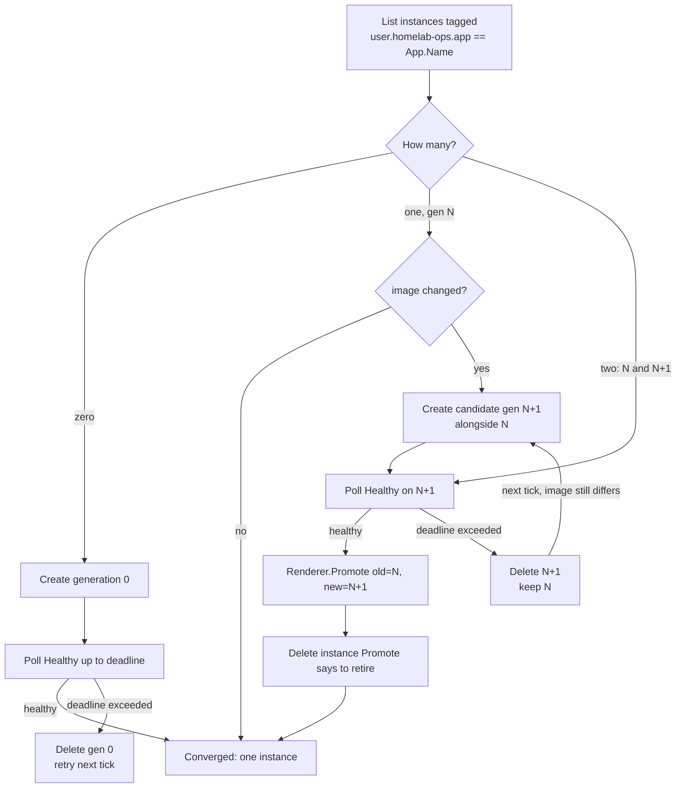

# App Manager — per-node agents, leader/follower HA, fleet-wide blue-green (0.x)

Purpose
- Define `kind: App`: a workload instance the app-manager agent fleet (#92) reconciles against live Incus, via a small renderer registry.
- Run one agent instance **per node**, electing a single fleet-wide leader — not one agent for the whole cluster — so the reconciliation loop survives losing whichever node happens to be running it. Incus itself has no mechanism to relocate a stateless instance onto a healthy node without shared storage (ceph) backing it, so the agent has to already be running everywhere ahead of time.
- Give every App type a blue-green upgrade path — create a candidate alongside the current instance, health-check it, then promote or revert — without hardcoding one cutover algorithm for every App type.
- Prove the mechanism by having the agent fleet manage its own upgrade (a reserved `type: agent` App declared once per node), with no operator intervention, no reconciliation gap, and survival of losing the node currently hosting the leader.

This doc complements `docs/Architecture.md` (system-wide shape) and `docs/Ipam.md` (the sibling per-subsystem policy doc this one mirrors); implementation-level detail lives in `internal/config` (schema), `internal/apprenderer` (registry + fleet reconcile algorithm), `internal/apprenderer/agentrenderer` (the built-in `agent` renderer), and `internal/leaderelection` (the lease/CAS mechanism). See `docs/Decisions.md` § App Manager HA for the full design rationale and the trade-offs accepted along the way.

## Deployment topology

One agent instance runs per node — declared the same way any per-node App is, one `App{type: agent, node: <n>}` entry per node in git (e.g. `agent-node0`, `agent-node1`, ...; existing `<app.Name>-g<generation>` naming already disambiguates per node, so this needs no schema change). Every agent process participates in leader election every tick; exactly one is ever active as **leader**, doing all reconciliation work fleet-wide. The rest are **followers**: they compete for the lease and keep their own instance's heartbeat alive, but otherwise do nothing — no independent per-node reconciliation, no self-initiated upgrades.

This is a deliberate departure from a leaderless, partitioned design (each agent reconciling only its own node's Apps): a single active reconciler avoids two agents racing to act on the same App, and — combined with agents already running on every node — gives the whole mechanism HA without needing Incus to relocate anything.

## `kind: App` schema

```yaml
kind: App
name: agent-node0
node: node0          # references a kind: Instance by name; no cross-node scheduling in 0.x
type: agent          # renderer-registry key
image:
  server: https://ghcr.io
  protocol: oci
  alias: ehharvey/homelab-ops/agent:latest
params: {}           # opaque, renderer-specific passthrough (e.g. extra env vars)
```

- `node` must reference a known `Instance.Name` — a hard validation error otherwise, same "typo is loud" convention as `Instance.Network`.
- `image` must set `alias` or `fingerprint`. `protocol: oci` pointing at `https://ghcr.io` is the production shape (Incus's OCI remote support — confirmed via the vendored `lxc/incus/v7` module's `ConnectOCI`); dev/validation points `server` at a local `registry:2` container instead.
- No per-App `strategy` field: cutover style (single-writer vs. dual-write, see below) is fixed per renderer `type`, not configurable per App instance — a DB renderer and a k8s-node renderer are different renderers, not the same renderer with a flag.
- No `version` field: a version bump is detected generically as "declared `image` differs from what's recorded on the live instance" (see Reconcile algorithm).
- Deploying the agent to every node is **not** a schema feature — it's the operator declaring one `App{type: agent}` entry per node, exactly like declaring any other App on multiple nodes. #99's incus-socket profile derivation already keys off "any App targeting this instance," so it preseeds correctly onto every node once every node has such an entry, with no code change.

## Renderer registry

```go
type Renderer interface {
    Desired(app config.App, name string) (lxcapi.InstancesPost, error)
    Healthy(ctx context.Context, c *incuslocal.Client, name string) (bool, error)
    Promote(ctx context.Context, c *incuslocal.Client, app config.App, old, new string) (retire string, err error)
}
```

This is the seam for renderer-specific cutover behavior instead of one hardcoded blue-green algorithm:
- A **single-writer** renderer (e.g. a future database App, blue = read/write, green = read-only) does real promotion work in `Promote` — a failover/handshake before the old instance is safe to delete.
- A **dual-write** renderer (e.g. Incus-hosted k8s worker nodes, both blue and green can serve/write at once) can make `Promote` a no-op or a short drain.
- The built-in `agent` renderer (proving self-management) has no data-plane cutover at all — its `Promote` is a no-op returning the old instance as safe to retire, because the App *is* the blue-green control plane being exercised, not a workload sitting on top of it.

Registration is explicit (`apprenderer.Register("agent", agentrenderer.Renderer{})`, called from `cmd/agent`'s own setup), not a self-registering blank import — v1 ships exactly one renderer.

## Leader election

A dedicated Incus project (e.g. `homelab-ops-meta`) holds never-started, config-bearing instances as the durable coordination record — the same "tag an Incus object, don't keep a separate store" philosophy the reconcile algorithm already uses for App generations, extended to fleet-wide coordination state.

- **Leader lease object**: `user.homelab-ops.lease.owner` (the agent instance holding it), `user.homelab-ops.lease.expiry` (RFC3339), `user.homelab-ops.lease.term` (a monotonically incrementing fencing counter, bumped on each new acquisition — cheap insurance against a stale writer acting after a handoff).
- **Acquisition/renewal** happens via Incus's ETag/`If-Match` conditional-write support: every agent, every tick, attempts to acquire-or-renew the lease with a conditional write keyed on the last-seen ETag. Only one write ever lands per contested tick — Incus's own conflict rejection is the entire concurrency mechanism, no separate distributed lock.
- **Renewal cadence is faster than the TTL** (e.g. renew at 1/3 of the lease lifetime) specifically to make losing the lease to a false expiry a non-event during normal operation — this is what "re-lease itself more frequently to avoid leader churn" means in practice.
- **"Am I leader" must always be re-derived from the last successful write**, never cached — a process that *believes* it's leader (e.g. after a GC-style pause) must re-check the lease before taking any leader-only action, since only the CAS write is authoritative.
- **Exactly one leader.** No sharded/multi-leader variant is used: splitting reconciliation work across simultaneously-active leaders reintroduces the coordination problem this design exists to avoid, for a scale this project doesn't operate at.
- **Incus's live instance state remains the source of truth for everything else.** The coordination project only ever holds hints (the lease, and the desired-version object below) — never a competing record of "what's actually running." That's still derived from `incus list` alone, exactly as the original per-node design already established.

### Scope note: this requires Incus running as a real cluster

Any agent, wherever it happens to run, needs to read/write the same lease object and reach every node's instances — which only works if Incus is initialized as a cluster (even a one-member one, as 0.x runs today) rather than a bare per-node daemon. See `docs/Decisions.md` § App Manager HA for the corrected single-node framing this implies.

## Reconcile algorithm (leader-only, fleet-wide)

No local store for the agent: the durable record is Incus itself, via `user.*` config keys and instance naming (`<app.name>-g<generation>`, e.g. `agent-node0-g0`/`agent-node0-g1` — directly legible in `incus list`). This mirrors "the runtime is the source of truth" (Nomad's allocation table, Kubernetes' live Pod list) rather than a separate cache the agent has to keep in sync.

Only the current leader runs this loop, iterating **every** declared App across the whole fleet (not filtered to one node) — using cluster-wide Incus reach instead of a single node-local socket. Followers never run this loop; they only maintain the lease-election tick and their own heartbeat.

Per App, per reconcile tick:



The "two matches" branch is what makes this restart-safe with zero external state: whether it's a genuine in-flight handoff or a leader that changed mid-handoff (the new leader picks up wherever `incus list` says the App is), "what step was I on" is always re-derivable from `incus list` alone — the tick just resumes the healthy/promote-or-revert logic directly.

**Self-recognition rule** (only applies to the App describing whichever node the current leader itself happens to be running on): before acting, the leader compares its own live instance name against N/N+1.
- It is the older, superseded instance (N): stand down — no further create/health/promote action on this one App once N+1 already exists — unless N+1 has exceeded its health deadline without promoting, in which case revert as normal. Never delete itself.
- It is the candidate (N+1): proceed normally — poll its own `Healthy`, `Promote`, delete N. Never delete itself.
- Neither (the overwhelming common case, including every non-agent App, and every other node's agent App): full normal reconciliation, no special-casing.

One rule lets a single, unmodified reconcile function handle self-management as a special case of the general algorithm, and guarantees the leader never issues a delete against its own running container.

**`Healthy` keeps its original meaning** — freshness of a heartbeat file the agent's own process writes on every tick. This write is independent of leader/follower status: every agent process writes its own heartbeat regardless of whether it currently holds the lease, purely so the check works whenever the *leader* evaluates that instance during a blue-green transition. This is not a new liveness/watchdog concept layered on top — ordinary instance disappearance is already covered by the zero-match → recreate branch above, and day-to-day process liveness inside an already-converged instance is Incus's own restart policy's job, not the leader's.

## Fleet-wide blue-green upgrade: one mechanism, not two

The agent's own self-upgrade is **not** a separate mechanism from the reconcile algorithm above — it's the same per-App state machine, applied to the `type: agent` App entries, driven fleet-wide by whichever process is leader. There's no "every agent watches for a version bump and replaces itself" behavior: followers never self-initiate anything, so a follower that crashes before ever getting a replacement is still covered — the leader's own fleet-wide scan finds and fixes it on the next tick, the same as any other App going from one match to zero.

The one addition specific to the agent's own version is a **desired-version object** in the coordination project: written only by the current leader, once it observes a bump via its own git poll, and checked only by that leader against its own running image — not a broadcast every agent reads and acts on. This exists so a leader can recognize "I am now stale" reliably (through the same always-reachable Incus surface every agent already depends on) even if, say, its own git-reachability is degraded at that exact moment.

```mermaid
sequenceDiagram
    participant Git as git config
    participant Meta as coordination project
    participant Old as old leader (node A)
    participant Incus as cluster-wide Incus
    participant New as new leader (node B, was follower)

    Git->>Old: version bump observed (next tick)
    Old->>Meta: write desired-version
    Old->>Incus: ReconcileFleet creates every stale App's<br/>candidate generation, including its own (node A: gen N+1)
    Note over Old,Incus: node A now has both gen N (old leader, self) and gen N+1 (candidate)<br/>every other node's agent App gets the same candidate-creation treatment
    Old->>Meta: read desired-version, compare to own image → stale
    Old->>Meta: stop renewing lease (self-recognition: never delete self)
    Meta-->>New: lease expires; New (already running new image, e.g. on node B) wins next CAS acquisition
    New->>New: becomes leader
    New->>Incus: ReconcileFleet resumes every in-flight App from live state alone
    New->>Incus: node A's App is "two matches" (N, N+1) → poll N+1 healthy → Promote → delete N
    Incus--)Old: gen N (old leader's own instance) torn down as a side effect
    New->>Incus: continues fleet-wide reconciliation alone, including cleanup<br/>of every other node's stale old-generation agent instances
```

Green's own `main()` never waits for a handoff signal — the moment the new leader is elected, it resumes fleet reconciliation purely from what `incus list` shows, with no memory of what the old leader was doing. The old leader never deletes itself; its own instance is torn down as a side effect of the new leader's ordinary `Promote`/delete call once healthy, exactly the same as any other App's handoff, just now potentially executed by a *different node's* process than the one that created the candidate.

## Prior art

This design's shape — create a candidate alongside the current instance, health-check it against a deadline, then promote (retire old) or revert (retire candidate) — is a scaled-down version of patterns already proven in cluster schedulers, adapted to a much smaller blast radius (this project's whole Incus cluster, not a large fleet) and much looser HA requirements (minutes-scale RTO is acceptable; no sub-second failover machinery needed):

- **Nomad's [`update` stanza](https://developer.hashicorp.com/nomad/docs/job-specification/update)** — `canary`/`max_parallel`/`min_healthy_time`/`healthy_deadline`/`auto_revert`/`auto_promote`: canary allocations run alongside old ones, get health-evaluated, then are promoted (old allocations stopped) or auto-reverted. This is the direct model for the create-candidate/health-poll/promote-or-revert loop above. Nomad's own guidance that host-volume-pinned singleton services can't truly canary (only one allocation can hold the volume) and instead do destructive updates, or app-level replication for read replicas, is exactly why this design leaves single-writer cutover semantics to each `Renderer.Promote` rather than a generic volume-aware canary mechanism.
- **Kubernetes' [Recreate vs. RollingUpdate](https://kubernetes.io/docs/concepts/workloads/controllers/deployment/#strategy)** deployment strategies, and the replica-1 StatefulSet shape more generally — this project's dominant workload shape (one active instance per App) is closer to a StatefulSet than a horizontally-scaled Deployment.
- **[Argo Rollouts' BlueGreen strategy](https://argo-rollouts.readthedocs.io/en/stable/features/bluegreen/)** — preview service, analysis, promotion, `scaleDownDelay` for fast rollback. The candidate/health-poll/promote shape above is a direct, much-simplified descendant of this.
- **Lease-based leader election** (etcd/Consul-style, or Kubernetes' own `client-go leaderelection` package built on the same CAS-lease idea) — the model for the acquire/renew/fencing-term mechanism above, minus the extra dependency: an ETag-conditional write against an Incus instance object stands in for etcd/Consul's own CAS primitive, since the project already needs Incus reachability everywhere and doesn't want a second coordination service.

What was deliberately **not** carried over, and why: a distributed scheduler with bin-packing/placement (`App.Node` is still fixed per App — no cross-node scheduling, this design only makes the *coordinator* HA, not the workload placement); cluster-wide canary traffic shifting (no load balancer/service mesh in scope — a renderer-specific `Promote` is the entire cutover surface); analysis-template-driven automated promotion (health is a single renderer-supplied boolean check against a deadline, not a metrics-driven analysis pipeline); Raft/multi-node consensus for the lease itself (a single CAS-guarded object is enough at this project's scale and lease-churn tolerance — no need to reimplement etcd's replication). All are proportionate to this project's actual scale and HA requirements, which deliberately don't match Kubernetes/Nomad/etcd's (see #92's context: several-minutes RTO is fine, and the dominant shape is one instance per App, not a horizontally-scaled fleet).

## Linkage

Renderer implementations and the fleet reconcile algorithm live in `internal/apprenderer`; schema and validation in `internal/config`; the built-in `agent` renderer in `internal/apprenderer/agentrenderer`; the local (unix-socket, now cluster-reaching) Incus client in `internal/incuslocal`; leader election and the coordination-project lease/desired-version objects in `internal/leaderelection`. See `docs/Decisions.md` § App Manager HA for the full design rationale and trade-offs, § 16 for the `incuslocal`/`nodeprovision` duplication-accepted-for-now call, and `docs/Out of Scope.md` for what's explicitly deferred past #92.
