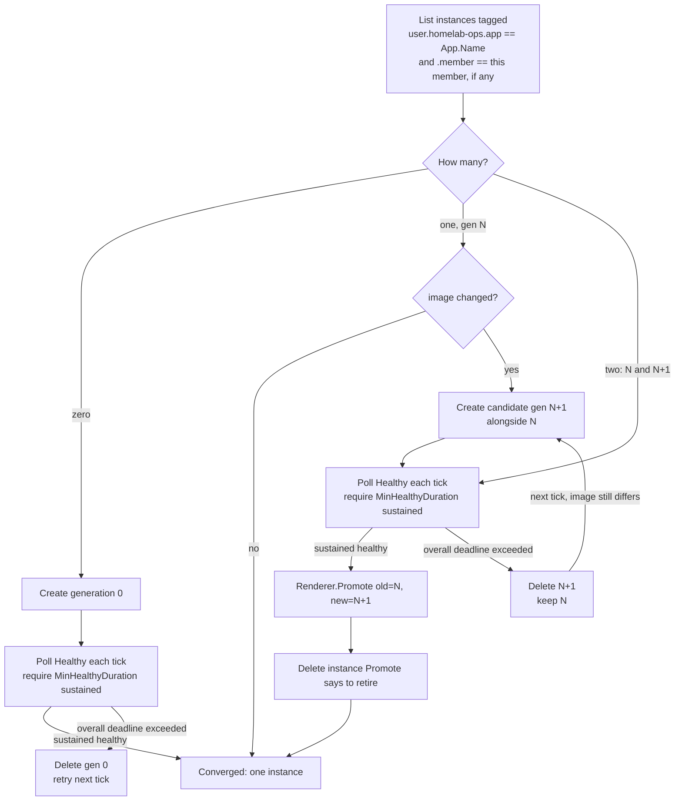
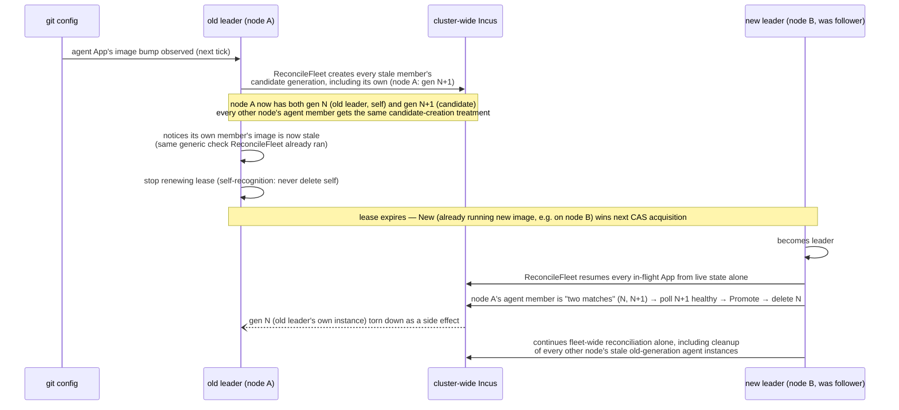

# App Manager — per-node agents, leader/follower HA, fleet-wide blue-green (0.x)

Purpose
- Define `kind: App`: a workload instance the app-manager agent fleet (#92) reconciles against live Incus, via a small renderer registry. Placement is Incus's problem, not the operator's — see `kind: App` schema below.
- Run one agent instance **per node**, electing a single fleet-wide leader — not one agent for the whole cluster — so the reconciliation loop survives losing whichever node happens to be running it. Incus itself has no mechanism to relocate a stateless instance onto a healthy node without shared storage (ceph) backing it, so the agent has to already be running everywhere ahead of time.
- Give every App type a blue-green upgrade path — create a candidate alongside the current instance, health-check it, then promote or revert — without hardcoding one cutover algorithm for every App type.
- Prove the mechanism by having the agent fleet manage its own upgrade (declared like any other App, via `replicas: per-node`), with no operator intervention, no reconciliation gap, and survival of losing the node currently hosting the leader.

This doc complements `docs/Architecture.md` (system-wide shape) and `docs/Ipam.md` (the sibling per-subsystem policy doc this one mirrors); `docs/AppClasses.md` is its companion reference, classifying the workloads this mechanism runs (which cutover shape a renderer implements, and why the registry is curated). Implementation-level detail lives in `internal/config` (schema), `internal/apprenderer` (registry + fleet reconcile algorithm), `internal/apprenderer/agentrenderer` (the built-in `agent` renderer), and `internal/leaderelection` (the lease/CAS mechanism). See `docs/Decisions.md` § App Manager HA for the full design rationale and the trade-offs accepted along the way.

## Deployment topology

One agent instance runs per node — but this is **not** operator-declared placement. The agent is an ordinary `kind: App` declaring `replicas: per-node` (see schema below): the leader synthesizes one App-shaped value per known `kind: Instance` from it, directly from the fleet's node list. Adding a node to the fleet is enough to get an agent on it; nothing node-specific needs to be authored for the agent. This is cardinality, not placement — the operator says *how many* ("one per node"), never *where* (see `docs/AppClasses.md` § Placement is a third axis).

Every agent process participates in leader election every tick; exactly one is ever active as **leader**, doing all reconciliation work fleet-wide (every App, real or synthesized). The rest are **followers**: they compete for the lease and keep their own instance's heartbeat alive, but otherwise do nothing — no independent per-node reconciliation, no self-initiated upgrades.

This is a deliberate departure from a leaderless, partitioned design (each agent reconciling only its own node's Apps): a single active reconciler avoids two agents racing to act on the same App, and — combined with agents already running on every node — gives the whole mechanism HA without needing Incus to relocate anything.

**Once a leader exists, the fleet self-expands.** A newly-joined `Instance` with no agent yet is just another zero-match case in the reconcile algorithm below — the leader creates its generation-0 agent the same way it would any other missing instance, no separate discovery mechanism required. The web app's `deploy-agent` route (#100) matters mainly for bootstrapping the very first agent (there's no leader yet to self-expand) and for recovery/air-gapped scenarios, not as a per-node step an operator repeats forever.

## `kind: App` schema

```yaml
kind: App
name: web-frontend   # unique across the fleet
type: some-renderer  # renderer-registry key
replicas: 1          # how many: a count, or `per-node`. Omitted → 1
image:
  server: https://ghcr.io
  protocol: oci
  alias: ehharvey/homelab-ops/some-app:latest
params: {}           # opaque, renderer-specific passthrough (e.g. extra env vars)
```

- **`replicas` is cardinality — *how many*, never *where*.** A count (`3`), or `per-node` (one per known `kind: Instance`, synthesized by the leader each tick — the DaemonSet shape; see below). Omitted means 1. It's parsed by a small `encoding.TextUnmarshaler` type in `internal/config`, exactly as `Range` already is for `dhcp_excluded_range`, so `per-node` and `3` both land typed at parse time.
- **No `node` field, and `replicas` is not a replacement for one.** Placement is Incus's problem in 0.x, not the operator's: `Desired()` builds the `InstancesPost` with no `Target`, so Incus's own scheduler decides — moot today since 0.x runs a single-member cluster anyway. When real placement logic is eventually needed (multi-member clusters with heterogeneous nodes), the intended mechanism is Incus's own **cluster groups** (tag members with a capability, target instance creation at the group) via a **separate** field — invalid in combination with `replicas: per-node` — rather than the operator naming individual nodes. `App.Node` was deleted precisely because it meant *how many* and *where* at once; keeping the two apart is why placement gets its own field rather than an overload of this one. See `docs/AppClasses.md` § Placement is a third axis, `docs/Decisions.md` § App Manager HA, and `docs/Out of Scope.md`. This also means the `App.Name`-keyed tagging the reconcile algorithm already uses (below) was never actually placement-dependent — dropping `node` cost nothing there.
- `image` must set `alias` or `fingerprint`. `protocol: oci` pointing at `https://ghcr.io` is the production shape (Incus's OCI remote support — confirmed via the vendored `lxc/incus/v7` module's `ConnectOCI`); dev/validation points `server` at a local `registry:2` container instead.
- No per-App `strategy` field: cutover style is fixed per renderer `type`, not configurable per App instance — a DB renderer and a k8s-node renderer are different renderers, not the same renderer with a flag. Which cutover shapes exist, and which one a given renderer is implementing, is `docs/AppClasses.md`.
- No `version` field: a version bump is detected generically as "declared `image` differs from what's recorded on the live instance" (see Reconcile algorithm). Note this is deliberately coarse — it says *that* the image changed, not *what kind* of change it is, which is sufficient for every renderer 0.x ships but not for a database or a quorum member (`docs/AppClasses.md` § Version skew).
- **The agent is an ordinary App**, declared exactly like any other with `replicas: per-node` and `type: agent`. An earlier revision of this design gave it a bespoke singleton `kind: AgentConfig`; that's been dropped, since per-node is a general shape (Alloy, #77, needs the identical thing) rather than an agent special case — see `docs/Decisions.md` § App Manager HA, "Follow-up: cardinality replaces `kind: AgentConfig`".

### `replicas: per-node` — the DaemonSet shape

```yaml
kind: App
name: agent
type: agent
replicas: per-node
image:
  server: https://ghcr.io
  protocol: oci
  alias: ehharvey/homelab-ops/agent:latest
params: {}
```

The leader synthesizes one `config.App`-shaped value per known `Instance` — `Name: "<app.name>-" + instance.Name`, `Type`/`Image` from the declaration — and feeds those through the exact same `Renderer`/reconcile machinery as any fixed-count App. Those values are never parsed from git as literal documents; they're rebuilt fresh each tick from the fleet's node list, which is what makes self-expansion fall out for free (below).

**Per-node synthesis injects per-instance identity.** The synthesized values are otherwise identical, so a renderer that needs to know which node it's on has no other source: the `agent` renderer depends on this via `AGENT_NODE_NAME`/`AGENT_INSTANCE_NAME`. This is general, not an agent quirk — #79's per-instance metrics cert needs the same hook, and a fleet-wide `params` map can't carry a per-node value.

At most one `per-node` App per renderer `type` (a second is a hard validation error, same "typo is loud" convention as duplicate `Network` names).

## Renderer registry

```go
type Renderer interface {
    Desired(app config.App, name string) (lxcapi.InstancesPost, error)
    Healthy(ctx context.Context, c *incuslocal.Client, name string) (bool, error)
    Promote(ctx context.Context, c *incuslocal.Client, app config.App, old, new string) (retire string, err error)
}
```

This is the seam for renderer-specific cutover behavior instead of one hardcoded blue-green algorithm. **`docs/AppClasses.md` is the reference for which cutover shapes exist** — it classifies Apps by what blue/green *overlap* costs, which is what determines how much work `Promote` has to do. In its terms:
- An **asymmetric-handover** renderer (class 3 — e.g. a future database App, blue = read/write, green = read-only) does real promotion work in `Promote` — a failover/handshake before the old instance is safe to delete.
- A **symmetric scale-out** renderer (class 4 — e.g. Incus-hosted k8s worker nodes, both blue and green can serve/write at once) can make `Promote` a no-op or a short drain.
- The built-in `agent` renderer is a **lease-guarded singleton** (class 2, not "stateless"): its `Promote` is a no-op returning the old instance as safe to retire, but the reason overlap is *safe* is the lease — only the holder acts, so a candidate running alongside the current leader does nothing until it wins an election. The App *is* the blue-green control plane being exercised, not a workload sitting on top of it.

Registration is explicit (`apprenderer.Register("agent", agentrenderer.Renderer{})`, called from `cmd/agent`'s own setup), not a self-registering blank import — v1 ships exactly one renderer.

**The registry stays curated: an App type is Go code, not a declarative `class:` field.** The taxonomy says why this isn't a limitation — the classes a declarative engine could drive (1/2/4/6) are exactly the ones where a renderer is a handful of lines, and the two that would justify one (3/5) can't use it, because handing over authoritative state is irreducible choreography. Kubernetes converged the same way: probes and hooks for the rest, operators-as-code for Postgres and etcd. Adding a renderer here is write it, build the agent image, bump the agent App's `image` — an ordinary blue-green agent upgrade through the mechanism below. Full rationale and revisit trigger: `docs/Decisions.md` § App classes.

## Leader election

A dedicated Incus project (e.g. `homelab-ops-meta`) holds a single never-started, config-bearing instance as the durable coordination record — the same "tag an Incus object, don't keep a separate store" philosophy the reconcile algorithm already uses for App generations, extended to fleet-wide coordination state. This project holds **only** the lease object below — there's no second "desired version" object; the leader detects its own staleness the same generic way it detects any App's version bump (see Fleet-wide blue-green upgrade).

- **Leader lease object**: `user.homelab-ops.lease.owner` (the agent instance holding it), `user.homelab-ops.lease.expiry` (RFC3339), `user.homelab-ops.lease.term` (a monotonically incrementing fencing counter, bumped on each new acquisition — cheap insurance against a stale writer acting after a handoff).
- **Acquisition/renewal** happens via Incus's ETag/`If-Match` conditional-write support: every agent, every tick, attempts to acquire-or-renew the lease with a conditional write keyed on the last-seen ETag. Only one write ever lands per contested tick — Incus's own conflict rejection is the entire concurrency mechanism, no separate distributed lock.
- **Renewal cadence is faster than the TTL** (e.g. renew at 1/3 of the lease lifetime) specifically to make losing the lease to a false expiry a non-event during normal operation — this is what "re-lease itself more frequently to avoid leader churn" means in practice.
- **"Am I leader" must always be re-derived from the last successful write**, never cached — a process that *believes* it's leader (e.g. after a GC-style pause) must re-check the lease before taking any leader-only action, since only the CAS write is authoritative.
- **Exactly one leader.** No sharded/multi-leader variant is used: splitting reconciliation work across simultaneously-active leaders reintroduces the coordination problem this design exists to avoid, for a scale this project doesn't operate at.
- **Incus's live instance state remains the source of truth for everything else.** The coordination project only ever holds a hint (the lease) — never a competing record of "what's actually running." That's still derived from `incus list` alone, exactly as the original per-node design already established.

### Scope note: this requires Incus running as a real cluster

Any agent, wherever it happens to run, needs to read/write the same lease object and reach every node's instances — which only works if Incus is initialized as a cluster (even a one-member one, as 0.x runs today) rather than a bare per-node daemon. See `docs/Decisions.md` § App Manager HA for the corrected single-node framing this implies.

**What 0.x actually validates.** 0.x provisions one physical node only, so there's only ever one real Incus cluster member — "leader failover" in this phase means multiple agent *instances* (one per declared `Instance`, all colocated on that single member) contesting the lease, proving the acquire/renew/handoff mechanism itself. It does not prove surviving the loss of an actual physical node, which additionally needs Incus's own dqlite fault-tolerance (an odd member count ≥3) once real multi-member clustering lands — see `docs/Decisions.md` § App Manager HA's trade-offs and #92's done-when.

## Reconcile algorithm (leader-only, fleet-wide)

No local store for the agent: the durable record is Incus itself, via `user.*` config keys and instance naming (`<app.name>-g<generation>`, e.g. `agent-node0-g0`/`agent-node0-g1`; `<app.name>-<ordinal>-g<generation>` for a multi-member App — directly legible in `incus list` either way). This mirrors "the runtime is the source of truth" (Nomad's allocation table, Kubernetes' live Pod list) rather than a separate cache the agent has to keep in sync.

Only the current leader runs this loop, over the union of two App sets, each independent (one App's error is logged/skipped, never blocks another):
1. Every real, git-declared `App` (no `Node` filter — placement is Incus's problem, see schema above).
2. For every App declaring `replicas: per-node`, one synthesized `App` per known `Instance`, built fresh each tick — never parsed from git as literal documents. In 0.x that's the `agent` App; Alloy (#77) is the next one.

Followers never run this loop; they only maintain the lease-election tick and their own heartbeat.

**The loop is keyed by `(App, member)`, not by `App`.** An App with `replicas: 3` has three members, each independently carrying its own generation — so the state machine below is the *inner* loop, run per member, and multi-instance costs one level of iteration rather than a different algorithm.

Members are **ordinals within a fixed-count App**, tagged `user.homelab-ops.member` alongside `.generation`, and named `<app.name>-<ordinal>-g<generation>` (`pg-0-g0`, `pg-1-g0`, …). Two cases have exactly one member and no ordinal, so their naming stays `<app.name>-g<generation>` and the loop degenerates to what it would be if members didn't exist:
- `replicas: 1` (the default).
- Every **synthesized per-node value** — its node identity is already in its `Name` (`agent-node0`), so it doesn't need a member segment too. Per-node fan-out produces *N single-member Apps*, not one App with N members; that's what keeps `internal/apprenderer` unable to tell a synthesized value from a real one, exactly as before.

**`max_parallel: 1`**: never act on two members of the same App in one tick. Different Apps still proceed independently — including the per-node agent values, which are separate Apps by the rule above, so **every node's agent still upgrades concurrently, fleet-wide, exactly as today** (this rule constrains a future `replicas: 3` database or quorum member, and changes nothing for anything 0.x declares). It's a hard requirement rather than a throttle: for a quorum member (`docs/AppClasses.md` class 5) upgrading two of three at once loses quorum outright.

Per App member, per reconcile tick:



The "two matches" branch is what makes this restart-safe with zero external state: whether it's a genuine in-flight handoff or a leader that changed mid-handoff (the new leader picks up wherever `incus list` says the App is), "what step was I on" is always re-derivable from `incus list` alone — the tick just resumes the healthy/promote-or-revert logic directly. This applies identically to a synthesized per-node App member and to a real declared one; the algorithm doesn't know or care which kind produced the value it's looking at, or which member of a multi-member App it is.

**Sustained health, not a single healthy tick, gates promotion.** A candidate that's merely healthy *at the instant it happens to be polled* isn't enough — a version flaky enough to crash-loop could still get a lucky poll. Each candidate carries a `user.homelab-ops.healthy-since` tag (RFC3339, unset until first observed healthy): the first tick `Renderer.Healthy` returns true, the leader sets it; every subsequent tick, if `Healthy` is still true and `now - healthy-since >= MinHealthyDuration` (an env-configurable knob, smaller than the overall health deadline above), the candidate is considered converged — eligible for promotion (gen N+1) or simply done (gen 0). If `Healthy` ever returns false again before that duration elapses, the tag is cleared: a flapping candidate never accumulates a continuous streak, so no number of individually-lucky healthy polls can satisfy the requirement. This is Nomad's `min_healthy_time` (§ Prior art), applied generically by the reconciler rather than by each renderer — `Renderer.Healthy` still only ever answers "healthy right now, yes or no"; the sustained-duration bookkeeping lives entirely in the tag, so it's restart-safe and leader-handoff-safe the same way everything else here is (re-derivable from `incus list` alone, nothing held in the reconciler's own memory).

**Self-recognition rule** (only applies to the one agent App member describing whichever node the current leader itself happens to be running on): before acting, the leader compares its own live instance name against N/N+1.
- It is the older, superseded instance (N): stand down — no further create/health/promote action on this one member once N+1 already exists — unless N+1 has exceeded its health deadline without promoting, in which case revert as normal. Never delete itself.
- It is the candidate (N+1): proceed normally — poll its own `Healthy`, `Promote`, delete N. Never delete itself.
- Neither (the overwhelming common case, including every real App, and every other node's agent member): full normal reconciliation, no special-casing.

One rule lets a single, unmodified reconcile function handle self-management as a special case of the general algorithm, and guarantees the leader never issues a delete against its own running container.

**`Healthy` keeps its original meaning** — freshness of a heartbeat file the agent's own process writes on every tick. This write is independent of leader/follower status: every agent process writes its own heartbeat regardless of whether it currently holds the lease, purely so the check works whenever the *leader* evaluates that instance during a blue-green transition. This is not a new liveness/watchdog concept layered on top — ordinary instance disappearance is already covered by the zero-match → recreate branch above, and day-to-day process liveness inside an already-converged instance is Incus's own restart policy's job, not the leader's.

## Fleet-wide blue-green upgrade: one mechanism, not two

The agent's own self-upgrade is **not** a separate mechanism from the reconcile algorithm above — it's the exact same per-member state machine, applied to the agent App's synthesized per-node members, driven fleet-wide by whichever process is leader. There's no "every agent watches for a version bump and replaces itself" behavior, and no separate "desired version" object anywhere: the leader detects its own staleness the *same generic way* it detects any App's version bump — by comparing its own synthesized member's live `user.homelab-ops.image` tag against the agent App's declared `image`, freshly read from its own git sync each tick, exactly like any other App going from "one match, image unchanged" to "one match, image changed."

Followers never self-initiate anything, so a follower that crashes before ever getting a replacement is still covered — the leader's own fleet-wide scan finds and fixes it on the next tick, the same as any other App going from one match to zero.



Green's own `main()` never waits for a handoff signal — the moment the new leader is elected, it resumes fleet reconciliation purely from what `incus list` shows, with no memory of what the old leader was doing. The old leader never deletes itself; its own instance is torn down as a side effect of the new leader's ordinary `Promote`/delete call once healthy, exactly the same as any other App's handoff, just now potentially executed by a *different node's* process than the one that created the candidate.

## Prior art

This design's shape — create a candidate alongside the current instance, health-check it against a deadline, then promote (retire old) or revert (retire candidate) — is a scaled-down version of patterns already proven in cluster schedulers, adapted to a much smaller blast radius (this project's whole Incus cluster, not a large fleet) and much looser HA requirements (minutes-scale RTO is acceptable; no sub-second failover machinery needed):

- **Nomad's [`update` stanza](https://developer.hashicorp.com/nomad/docs/job-specification/update)** — `canary`/`max_parallel`/`min_healthy_time`/`healthy_deadline`/`auto_revert`/`auto_promote`: canary allocations run alongside old ones, get health-evaluated, then are promoted (old allocations stopped) or auto-reverted. This is the direct model for the create-candidate/health-poll/promote-or-revert loop above — `min_healthy_time` and `healthy_deadline` specifically are directly implemented (the `healthy-since` tag and `MinHealthyDuration`/overall-deadline pair above), not just loose inspiration. Nomad's own guidance that host-volume-pinned singleton services can't truly canary (only one allocation can hold the volume) and instead do destructive updates, or app-level replication for read replicas, is exactly why this design leaves single-writer cutover semantics to each `Renderer.Promote` rather than a generic volume-aware canary mechanism. `auto_revert` is also directly implemented (deadline-exceeded → delete candidate, keep old); `auto_promote` has no analog here — promotion is always automatic once sustained-healthy, there's no separate manual-promotion mode.
- **Kubernetes' [Recreate vs. RollingUpdate](https://kubernetes.io/docs/concepts/workloads/controllers/deployment/#strategy)** deployment strategies, and the replica-1 StatefulSet shape more generally — this project's dominant workload shape (one active instance per App) is closer to a StatefulSet than a horizontally-scaled Deployment.
- **[Argo Rollouts' BlueGreen strategy](https://argo-rollouts.readthedocs.io/en/stable/features/bluegreen/)** — preview service, analysis, promotion, `scaleDownDelay` for fast rollback. The candidate/health-poll/promote shape above is a direct, much-simplified descendant of this.
- **Lease-based leader election** (etcd/Consul-style, or Kubernetes' own `client-go leaderelection` package built on the same CAS-lease idea) — the model for the acquire/renew/fencing-term mechanism above, minus the extra dependency: an ETag-conditional write against an Incus instance object stands in for etcd/Consul's own CAS primitive, since the project already needs Incus reachability everywhere and doesn't want a second coordination service.
- **Incus cluster groups** (Incus's own capability-tagging mechanism for targeting instance creation at a group of members rather than one named member) — the anticipated foundation for real placement, if/when this project needs it (see `kind: App` schema above and `docs/Out of Scope.md`), rather than a hand-rolled scheduler.

What was deliberately **not** carried over, and why: a distributed scheduler with bin-packing/placement (`kind: App` has no placement field at all in 0.x — this design only makes the *coordinator* HA, not workload placement; see `docs/Out of Scope.md`); cluster-wide canary traffic shifting (no load balancer/service mesh in scope — a renderer-specific `Promote` is the entire cutover surface); analysis-template-driven automated promotion (health is a single renderer-supplied boolean check, gated by sustained duration as above, not a metrics-driven analysis pipeline); **post-promotion auto-rollback** (Argo Rollouts' `scaleDownDelay` keeps the old ReplicaSet around briefly after promotion specifically so a fast rollback is possible if the new version degrades after taking traffic — this project deletes the old generation on promotion and has no equivalent: a version degrading *after* promotion isn't auto-detected or auto-reverted, only the pre-promotion sustained-health gate above guards against that, and only up to `MinHealthyDuration`'s window; see "Automatic rollback after a successful App promotion" in `docs/Out of Scope.md` and `docs/Decisions.md` § App Manager HA's leadership-churn trade-off); Raft/multi-node consensus for the lease itself (a single CAS-guarded object is enough at this project's scale and lease-churn tolerance — no need to reimplement etcd's replication). All are proportionate to this project's actual scale and HA requirements, which deliberately don't match Kubernetes/Nomad/etcd's (see #92's context: several-minutes RTO is fine, and the dominant shape is one instance per App, not a horizontally-scaled fleet).

## Linkage

Renderer implementations and the fleet reconcile algorithm live in `internal/apprenderer`; schema and validation (including `replicas`) in `internal/config`; the built-in `agent` renderer in `internal/apprenderer/agentrenderer`; the local (unix-socket, now cluster-reaching) Incus client in `internal/incuslocal`; leader election and the coordination-project lease object in `internal/leaderelection`. `docs/AppClasses.md` classifies the workloads this mechanism runs — read it before writing a renderer. See `docs/Decisions.md` § App Manager HA for the full design rationale and trade-offs (including "Follow-up: cardinality replaces `kind: AgentConfig`"), § App classes for why the registry is curated, § Stateful app support for the database/k8s direction, § 16 for the `incuslocal`/`nodeprovision` duplication-accepted-for-now call, and `docs/Out of Scope.md` for what's explicitly deferred past #92 (including capability-based placement).
